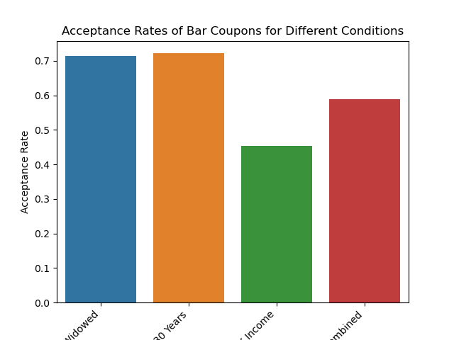

# Analysis of Coupon Acceptance

## Overview
This repository contains a Jupyter notebook that explores factors influencing the acceptance of coupons by customers for various types of establishments. The analysis focuses on various characteristics such as the time of day, weather conditions, customer demographics, and their previous behavior patterns.

## Key Findings for Bar Coupons
- **Demographic Insights**: Older demographics (over 25) have a higher likelihood of accepting the bar coupons, which may correlate with their
higher likelihood of being in the habit of visiting bars.
- **Economic Factors**: Acceptance rates tended to be higher for higher income levels, suggesting that bar patronage has a higher cost and
tends to attract a wealthier crowd.
- **Passenger Factors**: Coupon acceptance decreased when the passenger(s) were kid(s), which correlates with fact that bars tend to not
be welcoming toward underage people.
- **Previous Behavior Pattern**: Those who visit bars often are also likely to accept the bar coupon.

## Key Findings for Coffee House Coupons
- **Time of Day Impact**: Coupon acceptance rates are higher during morning hours, likely due to customers' preference for coffee in the morning.
- **Weather Influence**: Acceptance rates are somewhat higher on cold or rainy days, suggesting an increased desire for coffee during less pleasant weather.
- **Demographic Insights**: Younger demographics (under 30) have a higher likelihood of accepting coupons, which may correlate with their more frequent usage of coffee shops for social and work-related activities.
- **Economic Factors**: There is a noticeable correlation between lower income levels and the acceptance of coupons, indicating a sensitivity to pricing among this demographic group.

## Repository Contents
- `coupon_analysis.ipynb`: A Jupyter notebook containing detailed data analysis, visualizations, and statistical testing to understand the factors affecting coupon acceptance.

## How to Use
1. Clone the repository to your local machine using `git clone <repository-url>`.
2. Ensure you have Jupyter Notebook installed or use Jupyter Lab/Google Colab to open the `.ipynb` file.
3. Run the notebook cells sequentially to reproduce the analysis.

## Visualization
The notebook includes several visualizations such as bar charts that illustrate the relationship between various factors and coupon acceptance rates.

## Further Research
Further analysis could explore the impact of promotional marketing campaigns and customer service satisfaction on coupon acceptance rates.

## View Notebook
You can view the Jupyter notebook [directly on GitHub](coupon_analysis.ipynb) or via this [nbviewer link](https://nbviewer.org/github/monomial/ucbai-pa-5-1/blob/main/coupon_analysis.ipynb).
